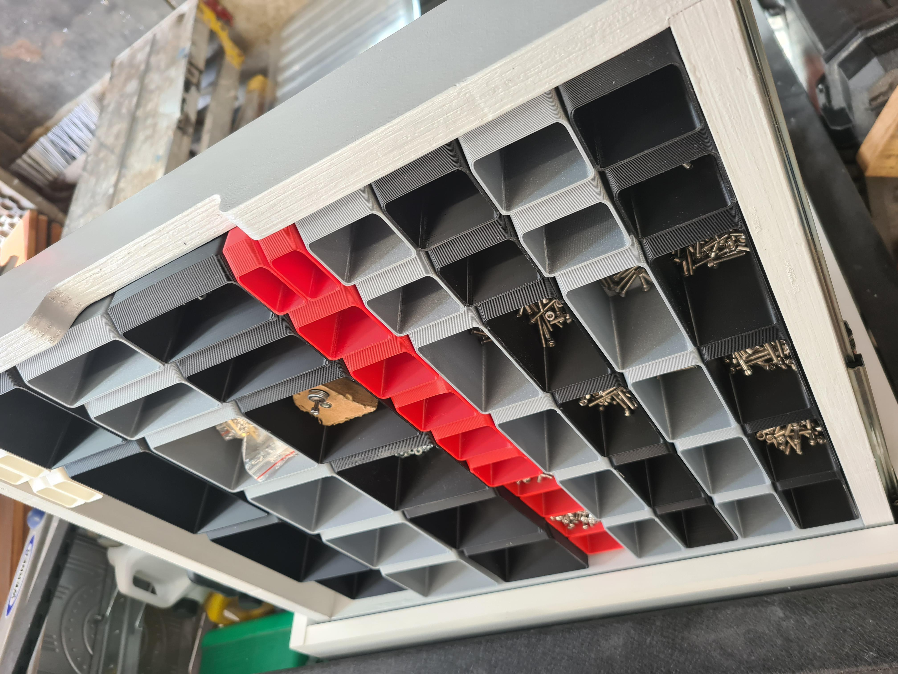

# Diy Part Drawer System 

## License

This project is licensed under the Creative Commons 4.0 license with 
Attribution-NonCommerial-ShareAlike see `LICENSE.txt` for details

## Webiste

Home of Root CNC can be found [Here](https://rootcnc.com/)

## Video
Youtube Videos [Here](https://youtu.be/O-uVevOGlKc)

Youtube Videos can be found [Here](https://www.youtube.com/sailorpete12)

## Slides 
BALL BEARING DRAWER RUNNERS 450MM 2 PACK (51598) [Here](https://www.screwfix.com/p/ball-bearing-drawer-runners-450mm-2-pack/51598)

## Handles 
CHEST HANDLES 105MM POLISHED SILVER 2 PACK (25668) [Here](https://www.screwfix.com/p/chest-handles-105mm-polished-silver-2-pack/25668)

## BOM

| Parts                  | QTY    |
|----------------------------------|----------|
| Drawer_Base               | 6      |
| Drawer_Front          | 6      |
| Drawer_Left         | 6      |
| Drawer_Rear         | 6      |
| Drawer_Right         | 6      |
| Frame_Rear         | 1     |
| Frame_SideLeft_Right         | 2      |
| Frame_Top_Base         | 2      |

## How to print
| Settings                  | Value    |
|----------------------------------|----------|
|Bottom layers           | 3|
|Perimters               | 2|
|Infill                | 0%|
|Top layers 	         | 0|